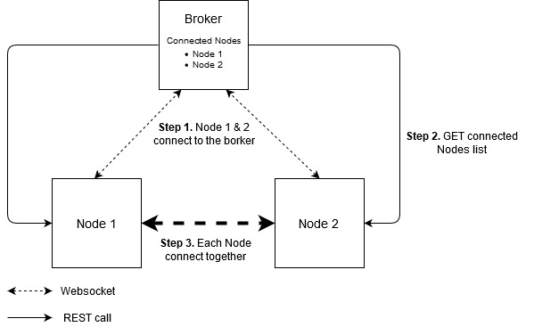
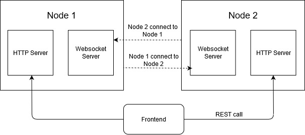

# BBcoin - Minimalist blockchain/cryptocurrency

_What is the best solution to learn about blockhain that to create a one.._

BBcoin is a minimalist blockhain. It implement many of the main required functionnality and can be easily runned in localhost in order to test it and play with it.

## 🧰 Key Concepts

- P2P network
- Simple proof-of-work algorithm
- Verify blockchain (to prevent tampering)
- Conflicts resolution
- Interface to make transactions on wallets

## 🏁 Getting Started

### Quick Start

1. Clone the project `git clone https://github.com/fabremx/bbchain.git`
2. Launch the broker server and serve the frontend `npm run servers`
3. Wait until the broker server is launched
4. Launch `npm run nodes` which will create and add 4 nodes to your network

### Advanced Commands

**broker**

```js
npm run broker // Launch the broker server
```

**Node**

```js
npm run node // Create one node with P2P PORT 6001 and HTTP PORT 3001
set P2P_PORT=6002 && set HTTP_PORT=3002 && npm run node // Create one node with P2P PORT 6002 and HTTP PORT 3002
npm run client // Launch the frontend on localhost:8080
```

**Frontend**

```js
npm run client // Launch the frontend on localhost:8080
```

**Others**

```js
npm run build // build the application
npm run tests // Launch tests
```

WARNING: Before launching any nodes make sure you ran before the broker server.

## ⚙️ How Works BBcoin

#### Architecture

BBcoin is divided into several parts :

- The broker server: Allow to know the nodes connected to the network. No data passes to the broker server
- Node: All Nodes are connected together and share it's blochcain state.
- Client: Simple web page to see easily the blockhain informations

#### P2P Network

BBcoin simulate a P2P network with Websocket. Below a schema explaining how one node connect together with the help of the broker.



- Step 1. A new node is created. It connect via websocket to the broker to notify that it exists and its ready to be connected with the others nodes. Except this simple connexion with the broker, no data are shared
- Step 2. Each nodes make every 5s a REST call to the broker to get the current connected nodes on the network.
- Step 3. Each Node connect to the new nodes or disconnect with killed nodes

All Nodes are thus connected together and can shar datas.

#### Node structure

To resume the operation of bitcoin nodes, our node are at the same time a full, light and miner node.
Each node have

- A Websocket server: Allow to the others nodes to connect to it
- A HTTP server: To expose information of the node. Usefull for the frontend to render blockchain infos.



Data are not persisted in the node. When a node is killed, it lose all its blockchain informations.
However if we connect a new node, its blockchain info will be updated with the correct blockchain contained in the others nodes

#### Blockchain structure

the blockchain is an assembly of blocks. The first block of the chain is called _Genesis Block_
Each block have 5 properties

- _Timestamp_ Date of block creation
- _transactions_ List of transaction (data of block)
- _previousHash_ determines the previous block hash
- _hash_ Hash of the block content - sha256(Timestamp + transactions + previousHash + nounce)
- _nounce_ random number which allow proof of work

_In case of conflicts_ between several nodes. The longer valid blockchain will be kept.

#### Proof of work

BBcoin use proof of work as consensus protocol. It uses the same principle that Bitcoin use.

When a transaction is made, each node wait 10s before to create the block and mine it. This time duration allow to add other transactions to the block before it will be created and mined.
A block is mined when the hash calculated begin with 3 zeros. This is called the difficulty and it is set to 3.

To avoid that each nodes of the network finish to mine the block at the same, BBcoin implementes a random time in addition of the difficulty. It simulate the case where nodes are launched on different machines with different calcul power.

#### Front end and Transactions

The frontend allow us to see the network and blockchain informations and test transactions.

_This frontend is very simplist. No business rules are implemented_
You can make transactions with any wallet to any wallet, have a negative balance on a wallet ...
